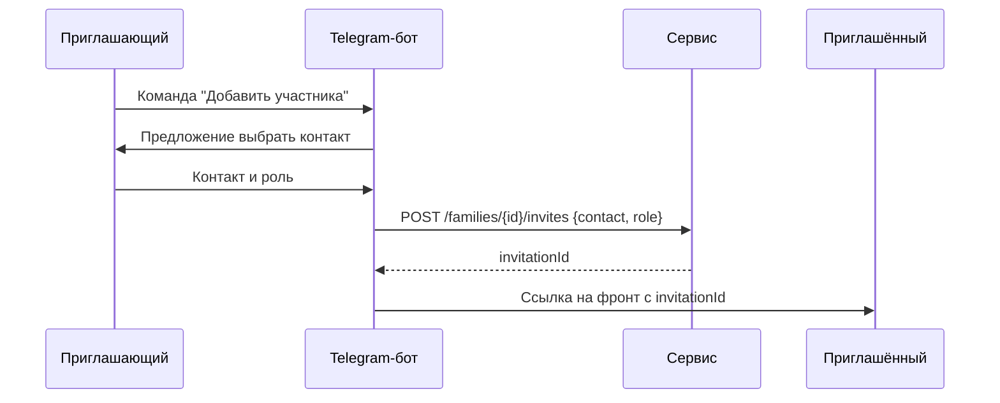
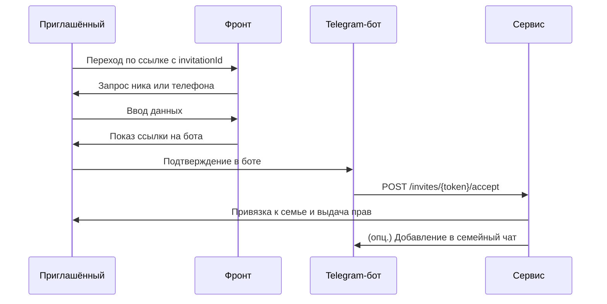

# Приглашения

## 1. Схема данных

| Поле        | Тип    | Описание                         |
|-------------|--------|----------------------------------|
| `id`        | string | Идентификатор приглашения.      |
| `familyId`  | string | Семья, в которую приглашают.    |
| `inviterId` | string | Кто пригласил.                  |
| `contact`   | string | Никнейм или телефон в Telegram.|
| `role`      | string | Роль после принятия.           |
| `expiresAt` | int    | Срок действия.                 |
| `status`    | string | `pending`, `accepted`, `revoked`.

Только участники с пермишеном `member:invite:create` (обычно owner и admin) могут создавать приглашения.

## 2. Создание приглашения через Telegram



## 3. Принятие приглашения



Если приглашённый уже имеет аккаунт в сервисе, шаги ввода никнейма и создания учётной записи пропускаются: бот сразу вызывает `POST /invites/{token}/accept`, пользователь получает новые права и актуальный `accessToken`.

## 4. Эндпоинты

### 4.1 `POST /families/{id}/invites`
Создать новое приглашение. Обычно вызывается Telegram-ботом после выбора контакта.

Параметры пути:
- `id` — идентификатор семьи.

Тело запроса:

```json
{ "contact": "@username", "role": "member" }
```

Успешный ответ:

```json
{
  "id": "inv-1",
  "familyId": "f-1",
  "inviterId": "u-1",
  "contact": "@username",
  "role": "member",
  "expiresAt": 0,
  "status": "pending"
}
```

Ошибки: `403 FORBIDDEN`, `404 FAMILY_NOT_FOUND`, `409 ALREADY_INVITED`.

### 4.2 `GET /families/{id}/invites`
Список приглашений семьи.

Параметры пути:
- `id` — идентификатор семьи.

Успешный ответ:

```json
[
  {
    "id": "inv-1",
    "contact": "@username",
    "role": "member",
    "status": "pending"
  }
]
```

Ошибки: `403 FORBIDDEN`, `404 FAMILY_NOT_FOUND`.

### 4.3 `POST /invites/{token}/accept`
Принять приглашение по токену. Вызывается ботом после подтверждения пользователя.

Параметры пути:
- `token` — уникальный токен приглашения.

Тело запроса отсутствует.

Успешный ответ:

```json
{
  "id": "inv-1",
  "familyId": "f-1",
  "role": "member",
  "status": "accepted"
}
```

Ошибки: `400 INVITE_EXPIRED`, `404 INVITE_NOT_FOUND`, `409 ALREADY_ACCEPTED`.

### 4.4 `DELETE /families/{id}/invites/{inviteId}`
Отозвать приглашение.

Параметры пути:
- `id` — идентификатор семьи.
- `inviteId` — идентификатор приглашения.

Ответ `204 No Content`.

Ошибки: `403 FORBIDDEN`, `404 INVITE_NOT_FOUND`.

## 5. Уведомления через Telegram

### 5.1 Личные уведомления
Бот отправляет сообщения конкретным пользователям о событиях в семье.

### 5.2 Уведомления в семейный чат
- Владелец семьи вручную приглашает бота в чат.
- После подключения бот может публиковать сервисные сообщения и приглашать новых участников в чат (если Telegram позволяет).
