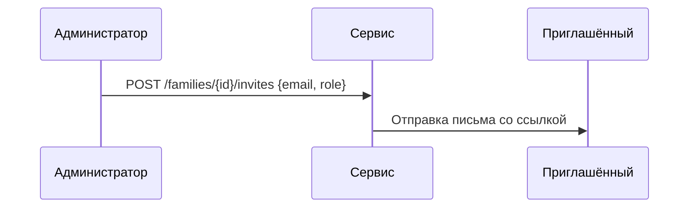
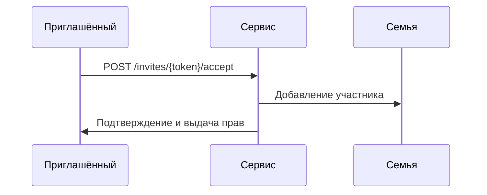

# Приглашения

## 1. Схема данных

| Поле        | Тип    | Описание                         |
|-------------|--------|----------------------------------|
| `id`        | string | Идентификатор приглашения.      |
| `familyId`  | string | Семья, в которую приглашают.    |
| `inviterId` | string | Кто пригласил.                  |
| `email`     | string | Почта или идентификатор.       |
| `role`      | string | Роль после принятия.           |
| `expiresAt` | int    | Срок действия.                 |
| `status`    | string | `pending`, `accepted`, `revoked`.

## 2. Создание приглашения

## 3. Принятие приглашения

