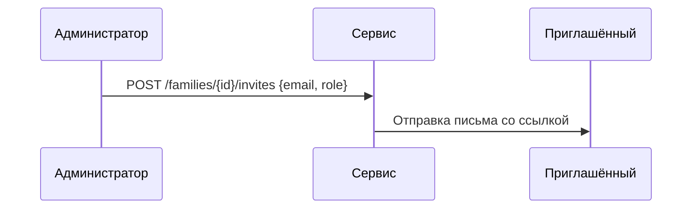
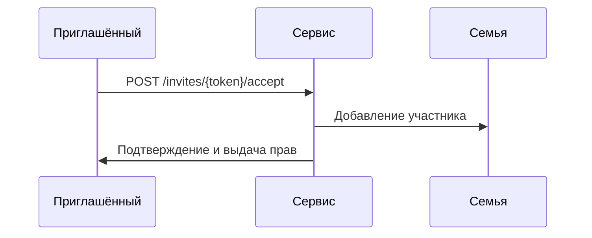

# Приглашения

## 1. Схема данных

| Поле        | Тип    | Описание                         |
|-------------|--------|----------------------------------|
| `id`        | string | Идентификатор приглашения.      |
| `familyId`  | string | Семья, в которую приглашают.    |
| `inviterId` | string | Кто пригласил.                  |
| `email`     | string | Почта или идентификатор.       |
| `role`      | string | Роль после принятия.           |
| `expiresAt` | int    | Срок действия.                 |
| `status`    | string | `pending`, `accepted`, `revoked`.

## 2. Создание приглашения



## 3. Принятие приглашения



## 4. Эндпоинты

### 4.1 `POST /families/{id}/invites`
Создать новое приглашение.

Параметры пути:
- `id` — идентификатор семьи.

Тело запроса:

```json
{ "email": "user@example.com", "role": "member" }
```

Успешный ответ:

```json
{
  "id": "inv-1",
  "familyId": "f-1",
  "inviterId": "u-1",
  "email": "user@example.com",
  "role": "member",
  "expiresAt": 0,
  "status": "pending"
}
```

Ошибки: `403 FORBIDDEN`, `404 FAMILY_NOT_FOUND`, `409 ALREADY_INVITED`.

### 4.2 `GET /families/{id}/invites`
Список приглашений семьи.

Параметры пути:
- `id` — идентификатор семьи.

Успешный ответ:

```json
[
  {
    "id": "inv-1",
    "email": "user@example.com",
    "role": "member",
    "status": "pending"
  }
]
```

Ошибки: `403 FORBIDDEN`, `404 FAMILY_NOT_FOUND`.

### 4.3 `POST /invites/{token}/accept`
Принять приглашение по токену.

Параметры пути:
- `token` — уникальный токен приглашения.

Тело запроса отсутствует.

Успешный ответ:

```json
{
  "id": "inv-1",
  "familyId": "f-1",
  "role": "member",
  "status": "accepted"
}
```

Ошибки: `400 INVITE_EXPIRED`, `404 INVITE_NOT_FOUND`, `409 ALREADY_ACCEPTED`.

### 4.4 `DELETE /families/{id}/invites/{inviteId}`
Отозвать приглашение.

Параметры пути:
- `id` — идентификатор семьи.
- `inviteId` — идентификатор приглашения.

Ответ `204 No Content`.

Ошибки: `403 FORBIDDEN`, `404 INVITE_NOT_FOUND`.
