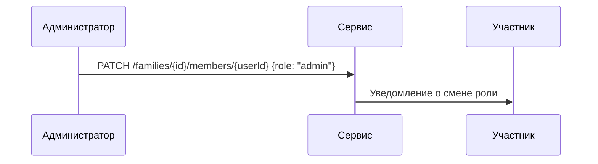

# Участники семьи

Схема данных: см. `../family/entities.md#member`.

## 1. Управление ролями

- Владелец может назначать роли другим участникам.
- Нельзя понизить или исключить владельца.
- Роль `guest` даёт только права чтения.

## 2. Сценарий смены роли



## 3. Эндпоинты

### 3.1 `GET /families/{id}/members`
Список участников семьи. Требуется право `member:list`.

Успешный ответ:

```json
[
  { "userId": "u-1", "role": "admin", "status": "active" }
]
```

Ошибки: `403 FORBIDDEN`, `404 FAMILY_NOT_FOUND`.

### 3.2 `POST /families/{id}/members`
Добавить участника. Право `member:add`.

Запрос:

```json
{ "userId": "u-2", "role": "member" }
```

Успешный ответ:

```json
{ "userId": "u-2", "role": "member", "status": "invited" }
```

Ошибки: `404 USER_NOT_FOUND`, `409 ALREADY_MEMBER`.

### 3.3 `PATCH /families/{id}/members/{userId}`
Изменить роль или статус участника. Право `member:update`.

Запрос:

```json
{ "role": "admin" }
```

Успешный ответ:

```json
{ "userId": "u-2", "role": "admin", "status": "active" }
```

Ошибки: `404 MEMBER_NOT_FOUND`, `409 CANNOT_DOWNGRADE_OWNER`.

### 3.4 `DELETE /families/{id}/members/{userId}`
Исключить участника. Право `member:remove`.

Ответ `204 No Content`.

Ошибки: `404 MEMBER_NOT_FOUND`, `400 CANNOT_REMOVE_OWNER`.
