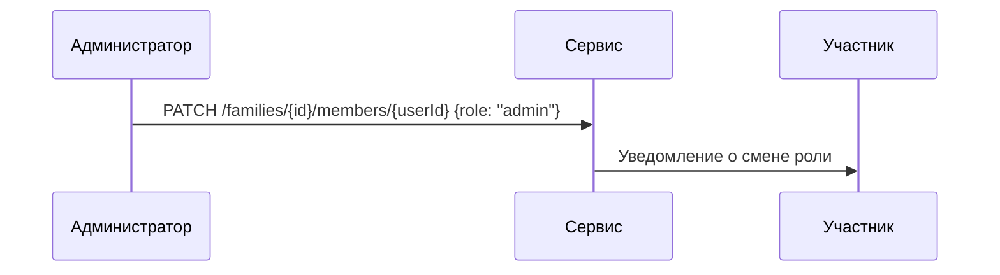

# Участники семьи

## 1. Схема данных

| Поле      | Тип    | Описание                         |
|-----------|--------|----------------------------------|
| `userId`  | string | Пользователь.                   |
| `familyId`| string | Семья.                          |
| `role`    | string | Роль в семье (`owner`, `admin`, `member`, `guest`). |
| `status`  | string | `active` или `invited`.         |

## 2. Управление ролями

- Владелец может назначать роли другим участникам.
- Нельзя понизить или исключить владельца.
- Роль `guest` даёт только права чтения.

## 3. Сценарий смены роли

