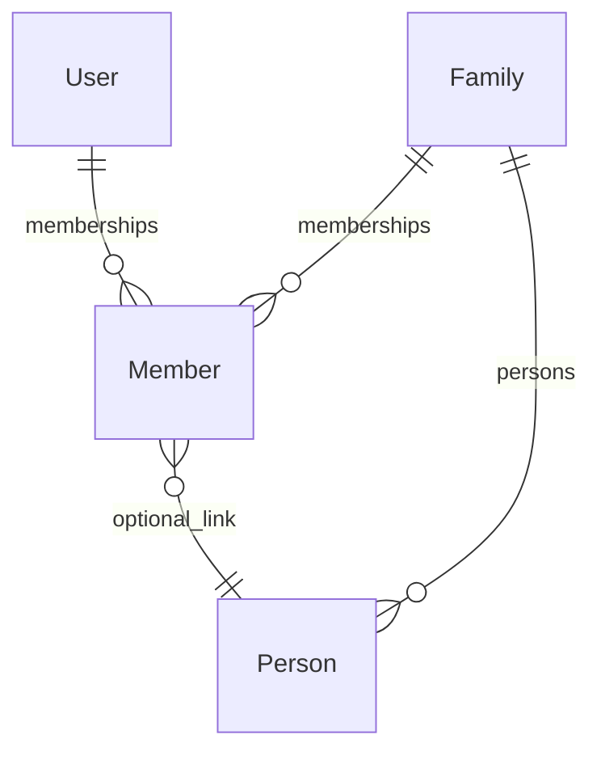

# User vs Member vs Person

Документ описывает различия и назначение трёх сущностей: `User`, `Member`, `Person`, а также их связи. Эта схема нужна для корректного разграничения аутентификации, членства в семье и генеалогических данных.

## Зачем три сущности
- **User (пользователь сервиса)**: учётная запись и аутентификация. Глобальная сущность вне контекста конкретной семьи.
- **Member (участник семьи)**: членство пользователя в конкретной семье с ролью и статусом. Основание для прав доступа.
- **Person (персона в дереве)**: узел генеалогического дерева семьи. Может не иметь аккаунта (например, предки, дети без учётной записи, ушедшие из жизни).

Вывод: для заявленных сценариев нужны все три сущности. Упрощение до двух возможно только ценой ограничения функциональности (см. «Можно ли упростить?»).

## Краткие определения и поля (MVP)

### User
- `id: string` — глобальный идентификатор пользователя.
- `name: string`, `avatarUrl?: string` — профиль.
- `telegramId?: string` — внешний идентификатор провайдера входа.
- `createdAt: int` — UNIX time создания.
- (опц.) пользовательские настройки, предпочитаемая активная семья.

Назначение: аутентификация, глобальные настройки, связь с внешними провайдерами. Не хранит ролей/прав — они на уровне Member.

### Member
- `userId: string`, `familyId: string` — составной ключ членства (уникальная пара).
- `role: string` — роль в семье (`owner`, `admin`, `member`, `guest`).
- `status: string` — `active` | `invited`.
- `joinedAt?: int`, `invitedBy?: string` — атрибуты онбординга.
- (опц.) `personId?: string` — ссылка на соответствующую Person в этой семье.

Назначение: контекст прав и доступа для конкретной семьи; именно от Member производятся permissions.

### Person
- `id: string`, `familyId: string` — узел дерева, принадлежит семье.
- `name: string`, `birthDate?: string`, `deathDate?: string`, `meta?: object` — данные персоны.
- Связи `Relation` связывают Person между собой (родители/дети/супруги и т. д.).

Назначение: модель реальных людей в пределах семьи, независимо от наличия аккаунта в сервисе.

## Связи между сущностями

- Один `User` может быть участником многих семей (несколько `Member`).
- `Person` живёт строго в пределах одной семьи; многие `Person` не имеют `User`.
- Связь Member→Person опциональна: участник может быть не привязан к узлу дерева на старте.

## Где что используется
- Авторизация/JWT/сессии — на уровне `User` (+ активная семья и права подтягиваются из членства).
- Права/доступ к API — на уровне `Member` (роль внутри семьи → permissions).
- Дерево родства и поиск по родственникам — на уровне `Person`/`Relation`.

## Можно ли упростить до двух?
- User + Person (без Member): не подходит — нужна роль и статус на уровне семьи, а один User может состоять в нескольких семьях с разными ролями.
- Member + Person (без User): не подходит — требуется глобальная аутентификация и учётная запись, независимая от семей.

Итого: для текущих требований упрощать не нужно. Разделение даёт:
- корректную многосемейность (один User → много Member);
- независимое генеалогическое дерево (Person без аккаунта);
- чистую модель безопасности (permissions из Member, а не из User).

## Практические сценарии (MVP)
- Приглашение:
  1) создаётся/находится `User` → 2) создаётся `Member(active)` → 3) (опц.) создаётся/связывается `Person`.
- Смена активной семьи: выбирается нужный `Member`, пересчитываются права, обновляется сессия/JWT.
- Удаление участника: `Member` становится удалён/неактивен; связанные `Person` и дерево сохраняются.

## Замечания по моделированию
- Уникальность `Member` по паре `(familyId, userId)`.
- Желательно хранить ссылку `Member.personId` как «основную» персону участника.
- Допускается дополнительная таблица связей «пользователь ↔ несколько персон» в расширенных сценариях (алиасы, слияния), но не обязательна для MVP.

## Привязка нового пользователя к существующему Person

Цель: когда в дереве уже есть узел человека (Person), а в сервис приходит реальный пользователь (User), корректно связать их через `Member.personId`.

Способы привязки:
- Через приглашение с `personId` (рекомендуется): при создании инвайта указывать `personId`. После принятия приглашения создаётся `Member(active)` и сразу выставляется `Member.personId = personId`.
- Ручная привязка администратором: owner/admin семьи может выбрать участника и привязать его к существующему Person через отдельный UI/эндпоинт (см. права в семье).
- Самопривязка с подтверждением: участник предлагает связать свою запись с Person; требуется подтверждение owner/admin, чтобы избежать ошибочных совпадений.

Защита от ошибок:
- Недопускать привязки одного `Person` к нескольким активным `Member` одновременно (если политика не допускает этого); разрешать перепривязку только с подтверждением.
- Логировать изменения и хранить историю привязок.

Минимальные требования по правам (по умолчанию):
- Привязка через инвайт — доступна создателю инвайта (owner/admin).
- Ручная привязка и подтверждение самопривязки — owner/admin.

## Когда создаётся сущность Person
- Явно в разделе генеалогии: пользователь с правами создаёт Person вручную в дереве семьи.
- При онбординге владельца (опционально): при создании семьи можно сразу создать Person для владельца.
- При работе с медиа: при расстановке тегов персон на фото/видео может создаваться новый Person (если он отсутствует).
- В приглашениях (опционально): при создании инвайта можно указать базовые данные и сначала создать Person‑заготовку, чтобы позже привязать нового участника.

